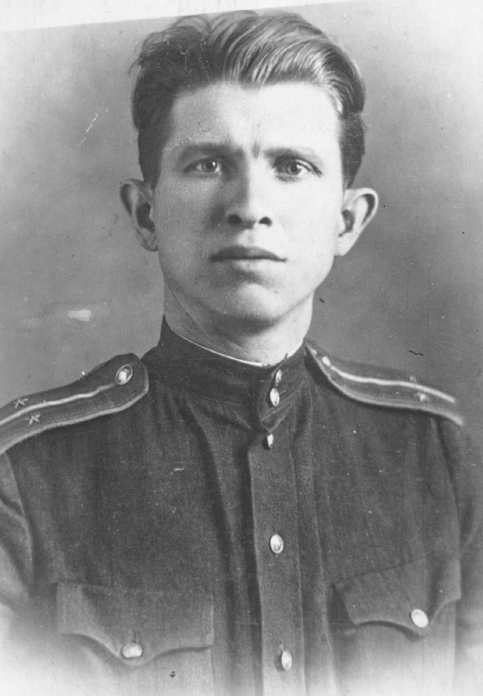
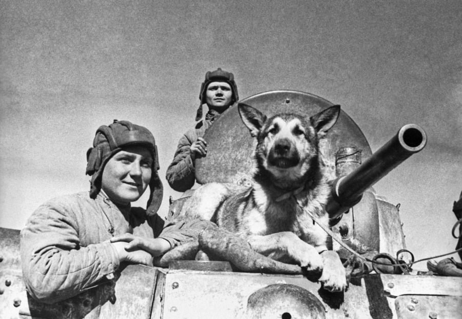

# Автоматический парсинг и модерация фотографий участников Великой 􏰁Отечественной войны

Данный проект выполнен в рамках хакатона <a target="_blank" href="https://memoryhack.ru">MemoryHack 2020</a> для проекта <a href="https://foto.pamyat-naroda.ru" target="_blank"> "Дорога памяти"</a>. 

В данный момент проект сталкивается со следующими проблемами:
- Огромная нагрузка на модераторов (до 100000 фото в день)
- Шутники/спамеры/вредители загружают на сайт неуместный контент  
- Необходимость в загрузке фото с дополнительных источников

Наша команда предлагает комплексное решение вышеперечисленный проблем благодаря автоматическому парсингу и модерации фогорафий участников ВОВ с помощью машинного обучения. Данный сервис состоит из модулей выгрузки и парсинга изображений, классификатора, модуля фильтрации и веб-сайта для отображения результата. 

# <a href="https://github.com/if1242/MemoryHack/tree/master/parsers">Выгрузка и парсинг</a>

В рамках хакатона были реализованы скрипты для выгрузки изображений по запросу из:
- Google
- Yandex
- Bing
- Flickr

Для выгрузки использовали запросы: 
- Герои ВОВ
- Участники ВОВ
- Великая Отечественная война лица
- Великая Отечественная война герои
- Дети войны
- Дети ВОВ
- Женщины в Великую Отечественную войну
- Солдаты ВОВ
- Ветераны
- Ветераны ВОВ
- Фронтовики
- Блокадники Ленинграда
- Герои блокады Ленинграда
- и т. д.

В среднем по каждому запросу можно вытащить порядка 100000 изображений. 
Для реализации парсеров был выбран <strong>язык Python</strong>, так как:
- Подходит для решения поставленной задачи
- Простой и универсальный
- Поддерживает множество библиотек 
 Также Python поддерживают такие гиганты IT как: Google; Dropbox; Mozilla; Facebook; Yandex; Red Hat; Microsoft; Intel; YouTube; Reddit; Instagram; PayPal; и др.

Для запуска парсера необходимо выполнить команды: 
<code>python google_parser.py #для Google</code> 
<code>python bing_parser.py #для Bing</code> 
<code>python flickr_parser.py #для Flickr</code> 
<code>python yandex_parser.py #для Yandex</code> 

Зависимости для корректной работы парсера прописаны в файле <a href="https://github.com/if1242/MemoryHack/blob/master/parsers/requirements.txt">requirements.txt</a>.

# <a href="https://github.com/if1242/MemoryHack/tree/master/classificator">Классификатор</a>

В данном проекте мы использовали предобученную модель <i>Inception-v3</i>, которую Google уже обучил на тысяче классов, но мы взяли наши собственные изображения. Благодаря <i>transfer learning</i>, мы смогли переобучить финальный слой уже обученной модели <i>Inception-v3</i> новым категориям с нуля. Для переобучения мы использовали <strong>Python 3 и TensorFlow 1.4.</strong> 

<strong>Причины и преимущества выбора данной технологии:</strong>
- Переобучение занимает около 30 минут на ноутбуке и не требует каких-либо графических процессоров
- У нас получилось сформировать объемный датасет для обучения (выгрузка с сайта "Дорога памяти" и из открытых источников Google, Yandex, Bing, Flickr)
- Модель уже предобучена на большом количестве классов, что увеличивает точность классификации 

В папке <a href=""><i>tf_files</i></a> мы разместили наш датасет (на github Вы видите только по одному примеру изображения из каждого класса). 
Наша модель классифицирует изображения по трем категориям: 
<ul>
<li><strong>Релевантные фото</strong> (фотографии довоенного, военного и послевоенного времени, на которых запечатлен Герой войны)</li>
 
<li><strong>Фото, требующие дополнительной модерации/обработки</strong> (фото, из которых можно вырезать одного человека или фото Героя войны с текстом рядом и т.д.)</li>
 
  <li><strong>Спам, реклама и прочий мусор</strong></li>
 
</ul>

При переобучении создается новый файл графов (<i>classificator/tf_files/retrained_graph.pb</i>) и новый файл меток (<i>classificator/tf_files/retrained_labels.txt</i>). 

 Для проверки модели необходимо в каталоге <i>classificator</i> поместить изображение и выполнить: 
 <code>python scripts/label_image.py --image image.jpg</code>

Пример вывода модуля для релевантного изображения: 
<code>dontknow 0.011057022 peoplewow 0.97300134 trashwow 0.00127021</code>

Данный модуль можно использовать независимо от проекта с целью переобучения модели для любых других нужд. Благодаря гибкой архитектуре имеется возможность переобучать отличные от <i>Inception-v3</i> модели, например, модели <a href="https://ai.googleblog.com/2017/06/mobilenets-open-source-models-for.html" target="_blank"><i>Mobilenet Models</i></a> и др. В нашем проекте данный модуль играет важную роль классификации изображений при автоматической модерации. 

# <a href="https://github.com/if1242/MemoryHack/tree/master/filters">Фильтрация выгруженных изображений по каталогам</a>

В рамках хакатона был разработан <strong>модуль фильтрации на языке Python</strong>, который позволяет разносить выгруженные изображения по нужным каталогам. В процессе фильтрации для каждого источника изображений (Google/Bing итп) формируется следующая структура каталогов:
- all/ (все выгруженные изображения)
- peoplewow/ (релевантные изображения)
- dontknow/ (изображения, требующие доп модерации)
- trashwow/ (спам и прочий мусор)

В каждом каталоге можно найти <strong>файлы изображения (.png/.jpg/.gif)</strong> и <strong>метафайлы .json</strong> с информацией об источнике и о том, что изображено на картинке. 

Для запуска фильтра требуется выполнить команду: 
<code>python filtration_google.py #для Google</code> 
<code>python filtration_bing.py #для Bing</code> 

Для корректной работы модуля фильтрации требуется установить зависимости из файла <a href="https://github.com/if1242/MemoryHack/blob/master/filters/requirements.txt">requirements.txt</a>.

# <a href="https://github.com/if1242/MemoryHack/tree/master/UI">UI</a> 

Для удобства демонстрации результата был реализован сайт, на котором можно видеть все выгруженные 
и классифицированные изображения. Для быстрой реализации был использован <strong>UI-kit MD-Bootstrap</strong>, в который были встроены скрипты на языке <strong>JavaScript</strong>. 

Для запуска UI необходимо скачать каталог и открыть в корневой запустить в браузере index.html.

# Преимущества решения

- Упрощение модерации и снижение нагрузки на сотрудников сервиса "Дорога памяти"
- Увеличение количества контента на сайте за счет автоматической выгрузки фото 
- Быстрые сроки внедрения и легкая ингеграция с любыми другими сервисами благодаря гибкой модульной архитектуре
- Возможность использования модулей по отдельности
- Простой и приятный интерфейс пользователя

# Контакты

Сайт: https://ibisolutions.team
Email: if1242@yandex.ru
